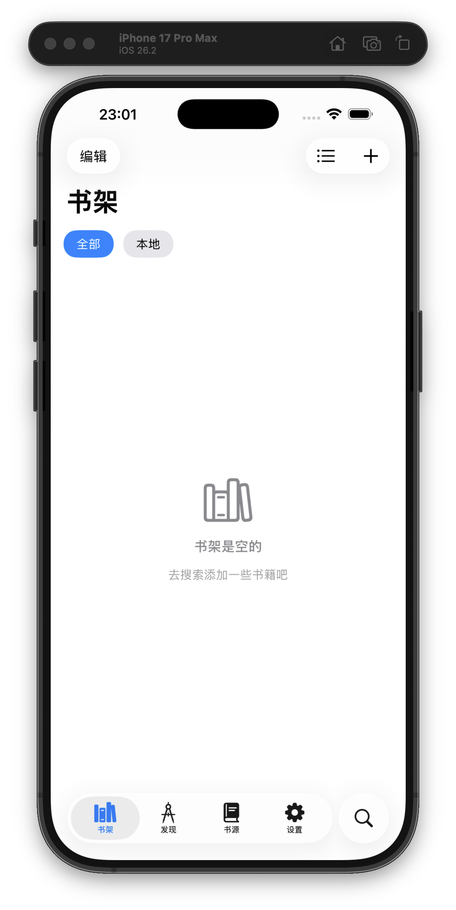
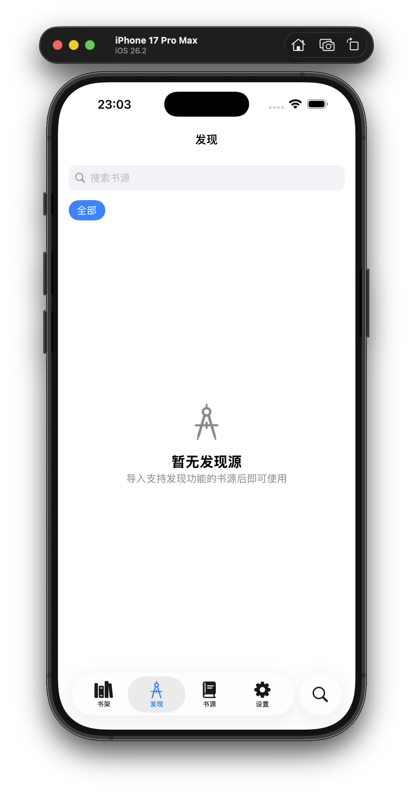
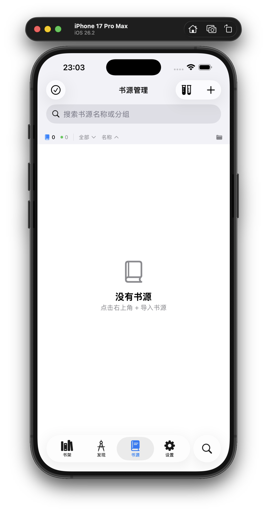
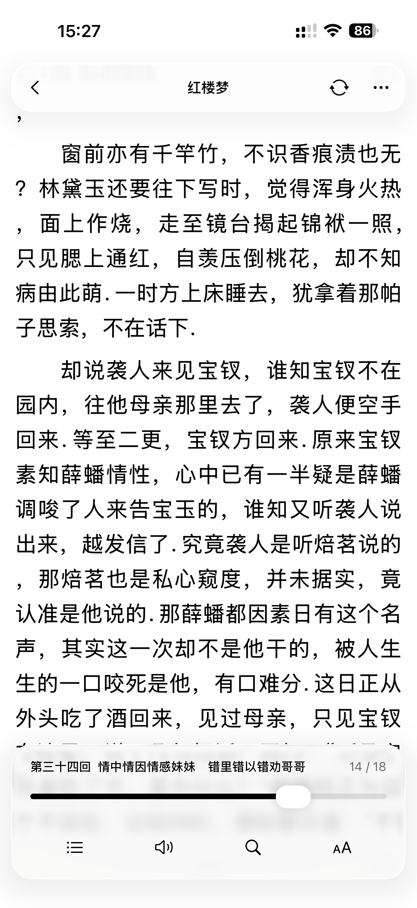
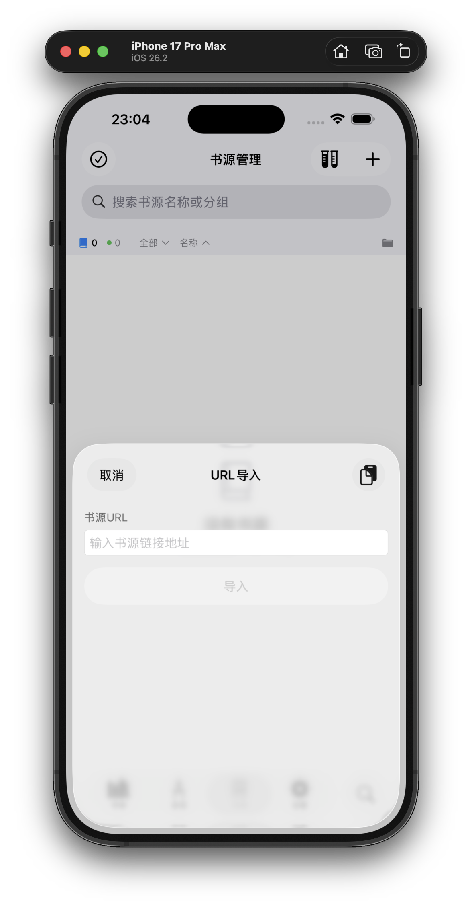
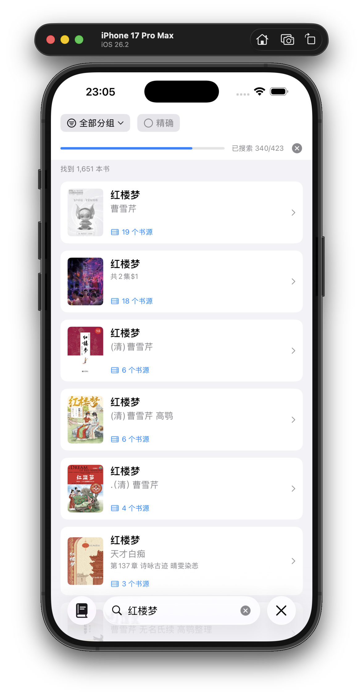
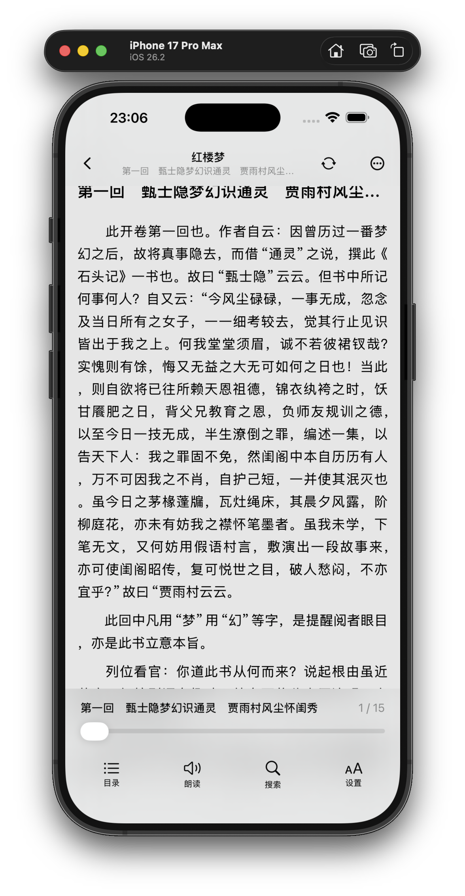
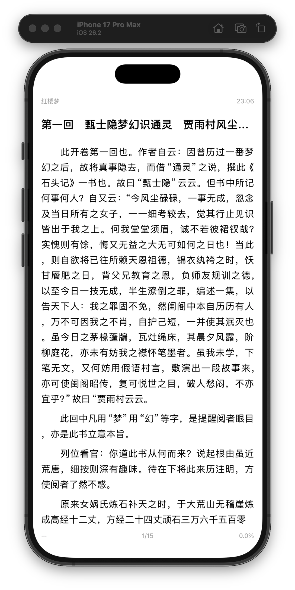
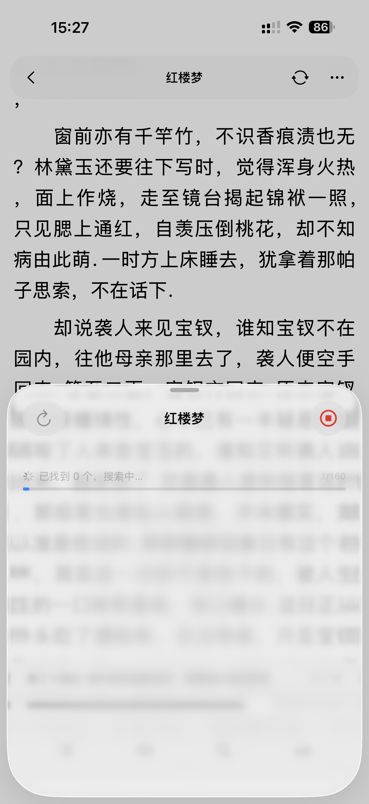

# Read（iOS / iPadOS 阅读客户端）

一款运行在 iOS / iPadOS 的阅读客户端：采用 **全新的 iOS 26 风格 UI 设计**，支持导入与使用第三方书源/规则配置，并可兼容约 **90%** 的“阅读 3.0”书源规则（具体兼容情况可能受规则复杂度、第三方站点变更与网络环境影响，以实际测试为准）。

> 提示：本应用程序不提供任何内容资源；书籍内容与书源/规则等配置均由使用者自行导入与设置。

## 系统支持

- iOS / iPadOS 17 - 26

## 截图

<table>
	<tr>
		<td></td>
		<td></td>
		<td></td>
	</tr>
	<tr>
		<td></td>
		<td></td>
		<td></td>
	</tr>
	<tr>
		<td></td>
		<td></td>
		<td></td>
	</tr>
</table>

## 已知问题：
- 目前仅在ios26测试
- 批量测试功能未完善，会卡死勿用
- 书源登陆有bug，待修复
- 书源管理界面有概率无法删除书源
- 部分js函数的实现有bug

## 待实现的功能
- 备份恢复
- 更强大的自定义界面
- 缓存功能
- 支持段评书源
- 看漫画源
- 音乐源

## 免责声明

- 本应用程序（read）为独立的 iOS / iPadOS 阅读客户端，与任何第三方项目（包括但不限于“Legado/阅读”）及其作者/组织不存在任何隶属、授权或合作关系。文中提及相关名称仅用于说明可能的格式兼容性或使用场景。
- 本应用程序不提供、亦不内置任何书籍内容、书源/订阅源、替换规则等配置。使用者通过网络访问或导入的任何内容均来自第三方。
- 使用者应自行确认所添加/访问内容及其来源的合法性，并遵守所在地法律法规及第三方网站/服务的使用条款。因使用者行为产生的一切法律责任由使用者自行承担。
- 受第三方站点结构变更、网络环境、规则配置差异等因素影响，书源解析/搜索/下载等功能可能出现不可用、结果偏差或延迟。本应用程序不就第三方内容的真实性、准确性、完整性、合法性或持续可用性作任何明示或默示保证。
- 如任何第三方认为其合法权益可能受到影响，请通过 GitHub Issues（或仓库主页载明的其他联系方式）提交通知。维护者将在合理范围内进行核查并作出必要处理。

## 侵权屏蔽说明

- 本应用程序不提供任何内容与书源/规则配置。若权利人或其合法授权代表认为第三方配置或相关说明可能导致侵权内容被访问/展示，可通过 GitHub Issues 提交“侵权通知/屏蔽申请”。
- 为便于核验与处理，请在通知中提供（如适用）：（1）被主张侵权内容的具体定位信息（链接、截图、规则标识等）；（2）侵权事实说明及拟采取措施建议（屏蔽/移除范围）。
- 在收到完整信息并进行合理核验后，维护者将视情况采取必要措施，补充风险提示或提供屏蔽指引。同时，使用者应自行删除或停止使用相关第三方配置。

## 参考项目

- Legado（Android 开源阅读）：https://github.com/gedoor/legado （仅用于致谢与技术参考，不代表任何隶属、授权或合作关系）
