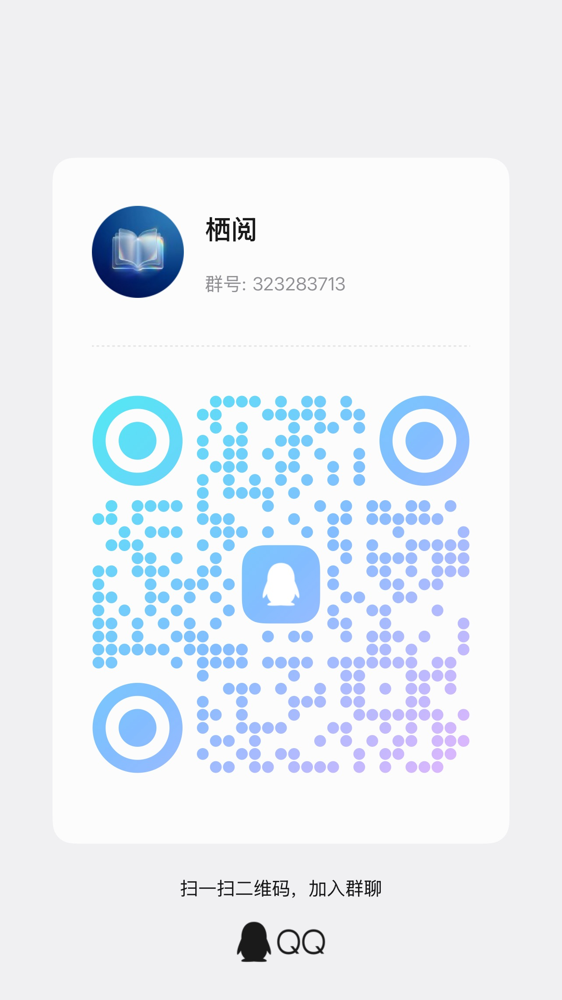
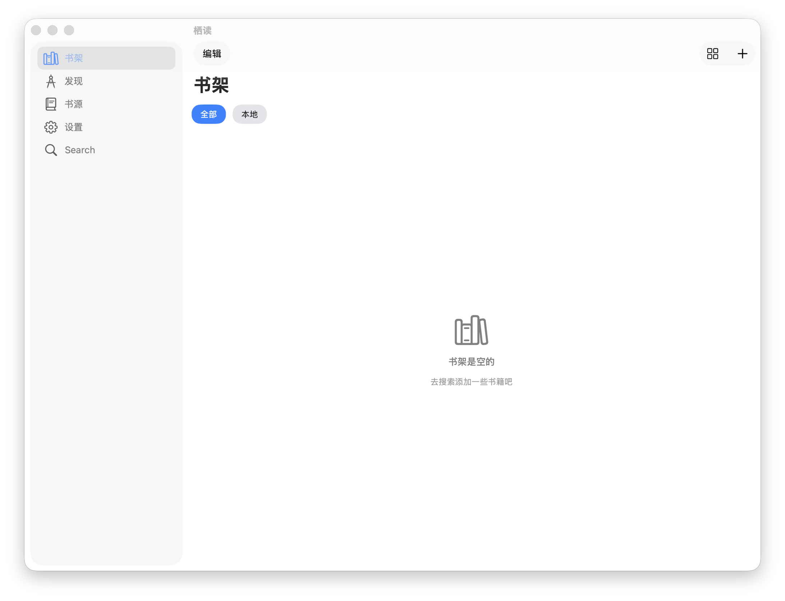

# 栖读

栖读（QiReader）是一款运行在 iOS / iPadOS（并可通过 Mac Catalyst 在 macOS 上运行）的阅读客户端：采用 **iOS 26 风格 UI 设计**，支持导入并使用第三方书源/规则配置，尽量兼容“阅读 3.0”书源规则（受规则复杂度、第三方站点变更与网络环境影响，实际可用性以测试结果为准）。

> 重要提示：本应用程序不提供任何内容资源；书籍内容与书源/规则等配置均由使用者自行导入与设置。

## 系统支持

- iOS / iPadOS 17 - 26
- macOS：通过 Mac Catalyst 运行（以实际构建与运行环境为准；Intel Mac 主要在 macOS 26 测试，Apple 芯片可优先使用 IPA 包）

## 测试交流

- QQ 群：323283713（TestFlight 测试）

## 截图

**iPhone / iPad**

<table>
	<tr>
		<td></td>
		<td></td>
		<td></td>
	</tr>
	<tr>
		<td></td>
		<td></td>
		<td></td>
	</tr>
</table>

**macOS（Mac Catalyst）**

## 已知问题
- ios部分版本无法沉浸小白条
- 自签有文件导入问题
- 平滑翻页时使用自定义背景图片会导致边缘空白
- 目前主要在 iOS 26 环境下测试，其他系统版本可能存在兼容性问题。
- “批量测试”功能尚未完善，可能出现卡死/无响应（建议暂时不要使用）。
- 部分 JS 函数兼容实现仍有缺陷，可能导致个别规则解析异常。
- 在线 TTS 功能尚未完善，不可用。
- 部分章节底部字体紧凑
- 解析/兼容层为纯 Swift 实现，并模拟了部分 Android 侧常用函数；整体逻辑较复杂，实际可用书源比例会随规则差异与站点变更波动。目前优先处理解析稳定性，其次再逐步处理不影响使用的 UI 问题。

## 待实现（Roadmap）

按优先级大致排序（会随反馈与开发进度调整）：
- 替换净化
- 书源分组管理
- 基于cloud kit的多端同步和云端书架
- icloud备份
- 书源编辑
- 阅读统计功能
- 备份/恢复功能
- 更强的阅读界面可自定义设置
- 书籍缓存能力完善
- 段评书源支持
- 漫画源
- 音乐源
- EPUB 阅读
- iOS 17 以下系统支持

## 免责声明

- 本应用程序（栖读）为独立的 iOS / iPadOS 阅读客户端，与任何第三方项目（包括但不限于“Legado/阅读”）及其作者/组织不存在任何隶属、授权或合作关系。文中提及相关名称仅用于说明可能的格式兼容性或使用场景。
- 本应用程序不提供、亦不内置任何书籍内容、书源/订阅源、替换规则等配置。使用者通过网络访问或导入的任何内容均来自第三方。
- 使用者应自行确认所添加/访问内容及其来源的合法性，并遵守所在地法律法规及第三方网站/服务的使用条款。因使用者行为产生的一切法律责任由使用者自行承担。
- 受第三方站点结构变更、网络环境、规则配置差异等因素影响，书源解析/搜索/下载等功能可能出现不可用、结果偏差或延迟。本应用程序不就第三方内容的真实性、准确性、完整性、合法性或持续可用性作任何明示或默示保证。
- 如任何第三方认为其合法权益可能受到影响，请通过 GitHub Issues（或仓库主页载明的其他联系方式）提交通知。维护者将在合理范围内进行核查并作出必要处理。

## 侵权屏蔽说明

- 本应用程序不提供任何内容与书源/规则配置。若权利人或其合法授权代表认为第三方配置或相关说明可能导致侵权内容被访问/展示，可通过 GitHub Issues 提交“侵权通知/屏蔽申请”。
- 为便于核验与处理，请在通知中提供（如适用）：（1）被主张侵权内容的具体定位信息（链接、截图、规则标识等）；（2）侵权事实说明及拟采取措施建议（屏蔽/移除范围）。
- 在收到完整信息并进行合理核验后，维护者将视情况采取必要措施，补充风险提示或提供屏蔽指引。同时，使用者应自行删除或停止使用相关第三方配置。

## 参考项目

- Legado（Android 开源阅读）：https://github.com/gedoor/legado （仅用于致谢与技术参考，不代表任何隶属、授权或合作关系）

